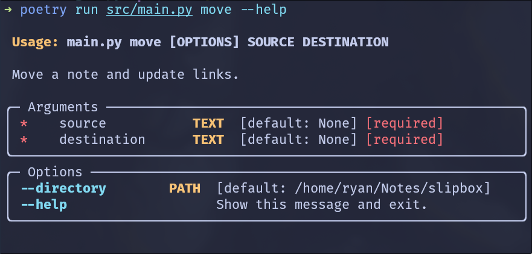

# Note Manager

This is a simple python tool to move markdown notes and update the links in the notes. This is primarily designed for nested directories (which are useful for breadcrumbs with, e.g., Quartz, WikiJS, mkdocs etc.).



## Installation

```bash
pipx install 'git+https://github.com/RyanGreenup/note_manager' --force
# use --force to update
```

## Usage

```
# Destination and source may be directories (git commit first)
nmgr move <source> <destination>
```


## Motivation
For example, in a flat corpus the following is (mostly) sufficient to rename a note:

```bash
file="note.md"
new_name="new_note.md"

mv "$file" "$new_name"
sed -i "s/$file/$new_name/g" *.md
```

However, when the notes are nested, the above approach will not work due to relative links. This tool is designed to handle this case:


```bash
poetry run src/main.py move ~/Notes/slipbox/university/current/ ~/Notes/slipbox/university/2024/
```


